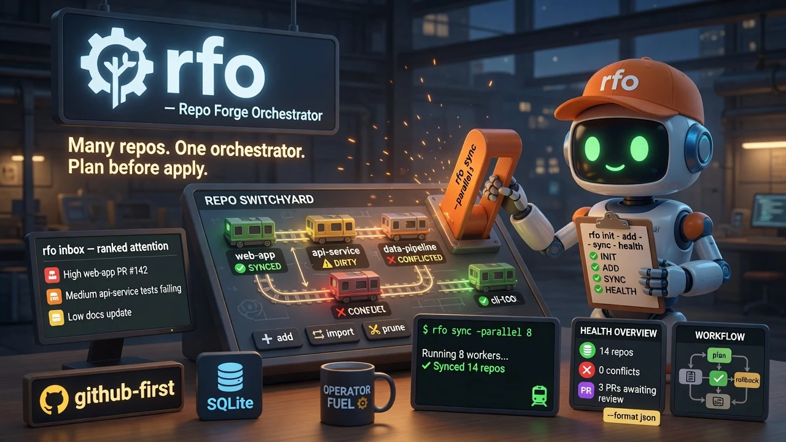

# ro — Repo Forge Orchestrator

<div align="center">
  
</div>

<div align="center">


</div>

**GitHub-first multi-repo orchestration for humans and AI agents.**  
Track many repos in SQLite, keep working copies synced, surface what needs attention, and run plan → apply → rollback automations with safety gates and JSON output.

<div align="center">

```bash
curl -fsSL "https://raw.githubusercontent.com/quangdang46/repo_orchestrator/main/install.sh?$(date +%s)" \
  | bash
```

</div>

---

## 🤖 Agent Quickstart (Robot Mode)

```bash
# Fleet health
ro health --format json

# Status of all tracked repos
ro status --format json

# Ranked attention
ro health --format json

# Plan automation
ro review plan --format json
```

**Output conventions**
- stdout = structured data (JSON)
- stderr = diagnostics, warnings
- exit 0 = success

---

## TL;DR

### The Problem

Managing dozens of GitHub repos by hand fails in predictable ways:

| Pain | Symptom |
|------|---------|
| Drift | Working copies behind / dirty / conflicted |
| Noise | Issues/PRs/CI mixed without ranking |
| Blind automation | Scripts mutate without a reviewable plan |
| Agent shell chaos | Models run raw `git`/`gh` with no safety gates |
| No audit trail | “What did we change last Tuesday?” |

### The Solution

**ro** is a Rust CLI that orchestrates many repos from one local SQLite source of truth:

| Capability | Command surface |
|------------|-----------------|
| Track & sync | `add` · `import` · `sync` · `status` · `prune` |
| Attention | `health` |
| Risky ops | `review plan` · plan → apply → rollback |
| Safety | secret scan · denylist · quality gates |
| Agents | `--format text|json|toon` · `ro schema` · MCP-friendly structure |

> **Status:** early development (v0.2.x) — public API and flags may shift before v1.0.

### Why Use ro?

| Feature | What it does |
|---------|--------------|
| **Fleet inventory** | One SQLite DB for all tracked repos |
| **First-class sync** | ff-only / rebase / merge, parallel, resume, autostash |
| **Ranked attention** | Health scores instead of tab soup |
| **Plan-then-apply** | Review/sweep flows produce plans before mutation |
| **Agent-ready JSON** | Structured reads for coding agents and MCP |
| **Doctor** | Diagnose and repair the local environment |

---

### Quick Example

```bash
ro init
ro add quangdang46/repo_orchestrator
ro sync -j 4
ro status --format json
ro health
ro doctor
```

---

## Design Philosophy

1. **GitHub-first, local source of truth.**  
   Remote is GitHub; authority for *what we track and did* is local SQLite.

2. **Plan before mutate.**  
   Review, sweep, and train-style flows should produce an inspectable plan before apply.

3. **Agents get JSON, not scraped TUI.**  
   Prefer `--format json` and `ro schema` over parsing human text.

4. **Safety gates over clever scripts.**  
   Secret scan, denylist paths, and quality checks beat “trust the model with raw git.”

5. **Degrade cleanly.**  
   Absent optional tools must not produce silent half-applies.

---

## How ro Compares

| Approach | Sync | Attention | Safe automation | Agent-ready |
|----------|------|-----------|-----------------|-------------|
| Manual `gh`/`git` | Manual | Manual | No | Fragile |
| Ad-hoc scripts | Partial | No | Rarely | Opaque |
| IDE multi-root | UI-only | Partial | No | Weak CLI |
| **ro** | First-class | Ranked health | Plan/apply | JSON + MCP |

**When to use ro:**
- You maintain a fleet of GitHub repos (personal monorepo farm, org mirror, agent lab)
- You want agents to sync/status/health without raw destructive git
- You need an audit trail of runs and plans

**When ro might not be ideal:**
- Single-repo day-to-day work (plain `git`/`gh` is enough)
- Non-GitHub hosts as primary (secondary support only)
- Fully offline environments without API/git network

---

## Installation

### Linux / macOS

```bash
curl -fsSL "https://raw.githubusercontent.com/quangdang46/repo_orchestrator/main/install.sh?$(date +%s)" | bash
```

Detects platform, downloads the release archive, **verifies SHA256**, installs to `~/.local/bin`.

| Variable | Default | Purpose |
|----------|---------|---------|
| `RO_VERSION` | `latest` | Pin tag, e.g. `v0.2.0` |
| `RO_INSTALL_DIR` | `$HOME/.local/bin` | Binary destination |
| `RO_NO_VERIFY` | unset | `1` skips checksum (avoid) |
| `RO_FORCE` | unset | `1` overwrites silently |

### Windows (PowerShell 5.1+)

```powershell
irm https://raw.githubusercontent.com/quangdang46/repo_orchestrator/main/install.ps1 | iex
```

Installs `ro.exe` to `%LOCALAPPDATA%\Programs\ro` and updates user `PATH`.

### From source

```bash
git clone https://github.com/quangdang46/repo_orchestrator.git
cd repo_orchestrator
cargo build --release
./target/release/ro --version
```

Requires Rust **1.85+**.

---

## Quick Start

```bash
ro init
ro add quangdang46/repo_orchestrator
ro sync
ro status
ro health
ro doctor
```

### Robot / JSON surface

```bash
ro health --format json
ro status --format json
ro list --format json
ro schema
```

Prefer structured reads over scraping TUI/text when driving agents.

---

## Commands

```text
ro [--config-dir <DIR>] [--state-dir <DIR>] [--quiet] [--verbose] [--non-interactive] <COMMAND>
```

| Group | Command | What it does |
|-------|---------|--------------|
| Setup | `init` · `doctor [--fix]` | Config + SQLite; diagnose/repair |
| Repos | `add` · `remove` · `list` · `import` · `prune --orphans --archive` | Track inventory |
| Sync | `sync` · `status` · `health` | Working copies + attention |
| Runs | `run list/show/timeline` | Inspect past runs |
| Conflicts | `conflict list/explain/abort/mark-resolved` | Merge/rebase recovery |
| Review | `review plan` (+ apply/rollback flows) | Plan-then-apply |
| Sweep | `sweep …` | Commit / agent sweep helpers |
| Config | `config` | Show / set configuration |
| Meta | `schema` | Machine-readable CLI reference |

```bash
# Inventory
ro add owner/repo
ro list --owner my-org --format json

# Sync fleet
ro sync --strategy ff-only -j 8 --autostash
ro sync --dry-run
ro sync --resume

# Attention
ro health --format json
ro status my-org/service-a

# Safety-oriented automation
ro review plan
ro doctor --fix
```

Run `ro --help` / `ro <cmd> --help` for full flags.

---

## Safety Model

| Gate | Default |
|------|---------|
| Secret scan | On before risky apply |
| Denylist paths | Blocks dangerous globs |
| Quality checks | Configurable |
| Plan-first | Review/sweep produce plans before mutation |
| Non-interactive | `--non-interactive` never prompts |

Absent tools degrade cleanly where the design allows — never silent half-applies.

---

## Configuration & State

| Path | Purpose |
|------|---------|
| Config dir | `$XDG_CONFIG_HOME/ro` (override: `--config-dir`) |
| State dir | `$XDG_STATE_HOME/ro` (override: `--state-dir`) |
| SQLite | Inventory, runs, health — under state dir |

```bash
ro init
ro config
ro doctor
```

---

## Architecture

```text
┌─────────────────────────────────────────────────────────────┐
│ CLI (crates/ro)                                            │
│  init · add · sync · health · review · schema · …          │
└────────────────────────────┬────────────────────────────────┘
                             │
     ┌───────────────────────┼───────────────────────┐
     ▼                       ▼                       ▼
┌──────────┐          ┌────────────┐          ┌────────────┐
│ ro-git  │          │ ro-github │          │ ro-sync   │
│ local vc │          │ API / gh   │          │ strategies │
└────┬─────┘          └─────┬──────┘          └─────┬──────┘
     │                      │                       │
     └──────────────────────┼───────────────────────┘
                            ▼
                   ┌────────────────┐
                   │ ro-state      │
                   │ SQLite source  │
                   │ of truth       │
                   └────────┬───────┘
                            │
              ┌─────────────┼─────────────┐
              ▼             ▼             ▼
        ro-review    ro-jobs/sweep   output       
        plan/apply    run timeline     agent surfaces
```

Workspace highlights: `ro-core`, `ro-config`, `ro-state`, `ro-git`, `ro-github`, `ro-sync`, `ro-review`, `ro-sweep`, `ro-jobs`, `ro-output`, …

---

## Troubleshooting

### `ro: command not found`

```bash
curl -fsSL "https://raw.githubusercontent.com/quangdang46/repo_orchestrator/main/install.sh?$(date +%s)" | bash
export PATH="$HOME/.local/bin:$PATH"
ro --version
```

### Auth / GitHub API errors

Ensure `gh auth status` works (or the token env your install expects). `ro doctor` reports common misconfigurations:

```bash
gh auth status
ro doctor
ro doctor --fix
```

### Sync conflicts

```bash
ro conflict list
ro conflict explain <id>
# resolve in the working tree, then:
ro conflict mark-resolved <id>
# or abort:
ro conflict abort <id>
```

### Interrupted parallel sync

```bash
ro sync --resume
```

### Checksum verification failed

```bash
# Retry with cache-bust; avoid RO_NO_VERIFY unless debugging
curl -fsSL "https://raw.githubusercontent.com/quangdang46/repo_orchestrator/main/install.sh?$(date +%s)" | bash
```

---

## Limitations

### What ro Doesn't Do (Yet)

- **Not a full IDE** — orchestrates repos; does not replace review judgment
- **GitHub-first** — other hosts are secondary
- **Pre-v1.0** — flags and schemas may change

### Known Limitations

| Capability | Current state | Notes |
|------------|---------------|-------|
| Multi-host VCS | ⚠️ Secondary | GitHub is the primary path |
| Network-free mode | ⚠️ Limited | Sync/import need API + git |
| Pixel-perfect TUI | ❌ | CLI + JSON first |
| Fully autonomous merge | ❌ | Plan/apply still needs human/agent policy |

---

## FAQ

### vs plain `gh`?

`gh` is one-repo oriented. `ro` tracks a fleet, ranks attention, and gates automation.

### Safe for agents?

Prefer JSON reads + plan commands. Do not give bare destructive git without review plans. Use `--non-interactive` in automation.

### Where is state?

Local SQLite under the configured state directory (`ro init` / `ro doctor`).

### Can I import stars / orgs?

No — bulk-loading a cloud org or stars list is orthogonal to managing a local
fleet, and `ro import` was removed. Register the repos you want:

```bash
ro add owner/repo        # clone and track
ro add .                 # track a repo you already have
```

### How do I install or upgrade?

`ro` does not self-update. Re-run the install script; it is idempotent and
replaces the binary in place.

```bash
# macOS / Linux
curl -fsSL https://raw.githubusercontent.com/quangdang46/repo_orchestrator/main/install.sh | bash

# Windows (PowerShell)
irm https://raw.githubusercontent.com/quangdang46/repo_orchestrator/main/install.ps1 | iex
```

Check what you have:

```bash
ro --version
```

Releases and checksums: <https://github.com/quangdang46/repo_orchestrator/releases>

---

## About Contributions

Please don't take this the wrong way, but I do not accept outside contributions for any of my projects. I simply don't have the mental bandwidth to review anything, and it's my name on the thing, so I'm responsible for any problems it causes; thus, the risk-reward is highly asymmetric from my perspective. I'd also have to worry about other "stakeholders," which seems unwise for tools I mostly make for myself for free. Feel free to submit issues, and even PRs if you want to illustrate a proposed fix, but know I won't merge them directly. Instead, I'll have Claude or Codex review submissions via `gh` and independently decide whether and how to address them. Bug reports in particular are welcome. Sorry if this offends, but I want to avoid wasted time and hurt feelings. I understand this isn't in sync with the prevailing open-source ethos that seeks community contributions, but it's the only way I can move at this velocity and keep my sanity.

---

## License

MIT (see [LICENSE](LICENSE)). Workspace metadata also allows `MIT OR Apache-2.0` for crate publishing flexibility.

---

<div align="center">

**Many repos. One orchestrator. Plan before apply.**

</div>
