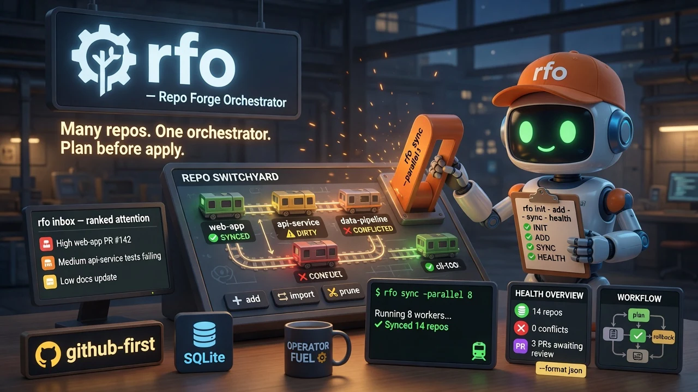

# ro — Repo Forge Orchestrator

<div align="center">
  
</div>

<div align="center">


</div>

**GitHub-first multi-repo orchestration for humans and AI agents.**  
Track many repos in SQLite, keep working copies synced, surface what needs attention, and run plan → apply → rollback automations with safety gates and JSON output.

<div align="center">

```bash
curl -fsSL "https://raw.githubusercontent.com/quangdang46/repo_orchestrator/main/install.sh?$(date +%s)" \
  | bash
```

</div>

---

## 🤖 Agent Quickstart (Robot Mode)

```bash
# The live CLI, as JSON — do not parse --help
ro schema

# Status of all tracked repos
ro status --format json

# What is tracked, one JSON object per line
ro list --format json

# A whole fleet: fetch, rebase, commit, push. One line per repo, then counts.
ro ship --format json

# The same run, previewed. Without --dry-run it really does commit and push.
ro ship --dry-run
```

**Output conventions**
- stdout = structured data (JSON)
- stderr = diagnostics, warnings
- exit 0 = success, 1 = partial, 2 = all failed
- 2 is also clap's own usage error (an unknown flag or a bad `--format`
  value). 64 is a **ro** usage error — you named something that matched
  nothing. 70 is fatal.

---

## TL;DR

### The Problem

Managing dozens of GitHub repos by hand fails in predictable ways:

| Pain | Symptom |
|------|---------|
| Drift | Working copies behind / dirty / conflicted |
| Blind automation | Scripts mutate with nothing to check them against |
| Agent shell chaos | Models run raw `git`/`gh` with no safety gates |
| No record | “What did ro do to this repo?” — answered per run, not per week |

### The Solution

**ro** is a Rust CLI that orchestrates many repos from one local SQLite source of truth:

| Capability | Command surface |
|------------|-----------------|
| Track & sync | `add` · `remove` · `list` · `sync` · `status` |
| Group | `tag` · `untag` · `tags` |
| Commit & push | `commit` · `push` · `ship` |
| Safety | secret scan · denylist · protected-branch refusal |
| Agents | `--format text\|json\|ndjson` · `ro schema` |

> **Status:** early development (v0.3.x) — public API and flags may shift before v1.0.

### Why Use ro?

| Feature | What it does |
|---------|--------------|
| **Fleet inventory** | One SQLite DB for all tracked repos |
| **First-class sync** | ff-only / rebase / merge, autostash |
| **Parallel fleet runs** | `ro ship` / `ro commit` / `ro push` run repos concurrently (`core.parallel`) |
| **Attention** | `ro status --dirty --ahead --behind` — the repos that need you |
| **An agent in the loop** | `claude` by default, `codex` or `git` — you choose per run |
| **Agent-ready JSON** | Structured reads for coding agents |
| **Doctor** | Diagnose and repair the local environment |

---

### Quick Example

```bash
ro init
ro add quangdang46/repo_orchestrator
ro sync
ro status --format json
ro doctor
```

---

## Design Philosophy

1. **GitHub-first, local source of truth.**  
   Remote is GitHub; authority for *what we track and did* is local SQLite.

2. **Preview is opt-in, and it is there.**  
   `--dry-run` on `commit`, `push` and `ship` shows the plan without writing
   it. Without the flag, the verb acts.

3. **Agents get JSON, not scraped TUI.**  
   Prefer `--format json` and `ro schema` over parsing human text.

4. **Safety gates over clever scripts.**  
   Secret scan, denylist paths, and protected-branch refusal beat “trust the
   model with raw git.”

5. **Degrade cleanly.**  
   Absent optional tools must not produce silent half-applies.

---

## How ro Compares

| Approach | Sync | Attention | Safe automation | Agent-ready |
|----------|------|-----------|-----------------|-------------|
| Manual `gh`/`git` | Manual | Manual | No | Fragile |
| Ad-hoc scripts | Partial | No | Rarely | Opaque |
| IDE multi-root | UI-only | Partial | No | Weak CLI |
| **ro** | First-class | Status filters | Preflight + gates | JSON + `ro schema` |

**When to use ro:**
- You maintain a fleet of GitHub repos (personal monorepo farm, org mirror, agent lab)
- You want an agent to commit and push across many repos without raw destructive git
- You want a per-run record of what was done to each repo

**When ro might not be ideal:**
- Single-repo day-to-day work (plain `git`/`gh` is enough)
- Non-GitHub hosts as primary (secondary support only)
- Fully offline environments without API/git network

---

## Installation

### Linux / macOS

```bash
curl -fsSL "https://raw.githubusercontent.com/quangdang46/repo_orchestrator/main/install.sh?$(date +%s)" | bash
```

Detects platform, downloads the release archive, **verifies SHA256**, installs to `~/.local/bin`.

| Variable | Default | Purpose |
|----------|---------|---------|
| `RO_VERSION` | `latest` | Pin tag, e.g. `v0.2.0` |
| `RO_INSTALL_DIR` | `$HOME/.local/bin` | Binary destination |
| `RO_NO_VERIFY` | unset | `1` skips checksum (avoid) |
| `RO_FORCE` | unset | `1` overwrites silently |

### Windows (PowerShell 5.1+)

```powershell
irm https://raw.githubusercontent.com/quangdang46/repo_orchestrator/main/install.ps1 | iex
```

Installs `ro.exe` to `%LOCALAPPDATA%\Programs\ro` and updates user `PATH`.

### From source

```bash
git clone https://github.com/quangdang46/repo_orchestrator.git
cd repo_orchestrator
cargo build --release
./target/release/ro --version
```

Requires Rust **1.85+**.

---

## Quick Start

```bash
ro init
ro add quangdang46/repo_orchestrator
ro sync
ro status
ro doctor
```

### Robot / JSON surface

```bash
ro status --format json
ro list --format json
ro schema
```

Prefer structured reads over scraping TUI/text when driving agents.

---

## Commands

```text
ro [--config-dir <DIR>] [--state-dir <DIR>] [--non-interactive] <COMMAND>
```

| Group | Command | What it does |
|-------|---------|--------------|
| Setup | `init` · `doctor [--fix]` | Config + SQLite; diagnose/repair |
| Repos | `add` · `remove [--delete]` · `list` | Track inventory |
| Group | `tag` · `untag` · `tags` | Tags, and `--tag` selection on the fleet verbs |
| Sync | `sync` · `status` | Working copies + attention |
| Commit | `commit` · `push` · `ship` | Engine, then commit, then push |
| Config | `config` | Show / set configuration |
| Meta | `schema` | Machine-readable CLI reference |

```bash
# Inventory
ro add owner/repo
ro add .                       # adopt a checkout you already have
ro list --owner my-org --format json

# Sync fleet
ro sync --strategy ff-only --autostash
ro sync --dry-run
ro sync --prune                # git remote prune, not a verb

# Attention
ro status my-org/service-a
ro status --dirty --behind

# Safety-oriented automation
ro doctor --fix
```

Run `ro --help` / `ro <cmd> --help` for full flags, or `ro schema` for the
same tree as JSON.

---

## Safety Model

| Gate | Default |
|------|---------|
| Secret scan | Blocks the commit; not configurable |
| Denylist paths | Blocks dangerous globs, at any depth |
| Protected branches | Refused: `main`, `master`, `production`, `staging`, `release/*` |
| Dry run | Opt-in: `--dry-run` on `commit`, `push`, `ship`, `sync` |
| Non-interactive | `--non-interactive` never prompts |

Absent tools degrade cleanly where the design allows — never silent half-applies.

---

## Configuration & State

| Path | Purpose |
|------|---------|
| Config dir | `$XDG_CONFIG_HOME/ro` (override: `--config-dir`) |
| State dir | `$XDG_STATE_HOME/ro` (override: `--state-dir`) |
| SQLite | Inventory, tags, per-repo settings — under state dir |

```bash
ro init
ro config
ro doctor
```

`ro config set KEY=VALUE` parses the value as TOML, so a string needs quotes:
`ro config set 'agent.engine="codex"'`. An integer does not:
`ro config set core.parallel=4`.

---

## Architecture

```text
┌─────────────────────────────────────────────────────────────┐
│ CLI (crates/ro)                                            │
│  init · add · remove · list · sync · status · tag ·       │
│  untag · tags · commit · push · ship · doctor · config ·   │
│  schema                                                     │
└────────────────────────────┬────────────────────────────────┘
                             │
     ┌───────────────────────┼───────────────────────┐
     ▼                       ▼                       ▼
┌──────────┐          ┌────────────┐          ┌────────────┐
│ ro-git  │          │ ro-engine  │          │ ro-sync   │
│ local vc │          │ claude /   │          │ strategies │
│ + safety │          │ codex / git│          │ + targets │
└────┬─────┘          └─────┬──────┘          └─────┬──────┘
     │                      │                       │
     └──────────────────────┼───────────────────────┘
                            ▼
                   ┌────────────────┐
                   │ ro-state      │
                   │ SQLite source  │
                   │ of truth       │
                   └────────┬───────┘
                            │
              ┌─────────────┼─────────────┐
              ▼             ▼             ▼
        ro-config     ro-sweep       ro-core
        config file   denylist +     credentials,
        + identity    secret scan    exit codes
```

Workspace: `ro-core`, `ro-config`, `ro-state`, `ro-git`, `ro-github`, `ro-sync`,
`ro-engine`, `ro-sweep`, `ro-jobs`, `ro-testkit`. The CLI depends on all but
the last — `ro-testkit` is a dev-dependency, so it is compiled into the test
suite and never linked into the shipped binary.

---

## Troubleshooting

### `ro: command not found`

```bash
curl -fsSL "https://raw.githubusercontent.com/quangdang46/repo_orchestrator/main/install.sh?$(date +%s)" | bash
export PATH="$HOME/.local/bin:$PATH"
ro --version
```

### Auth / GitHub API errors

Ensure `gh auth status` works (or the token env your install expects). `ro doctor` reports common misconfigurations:

```bash
gh auth status
ro doctor
ro doctor --fix
```

### Conflicts

There is no `ro conflict` verb. A conflict is a **stage** inside
`ro ship` and `ro push`:

```bash
ro ship                       # rebases; on a conflict, reports and hands over
ro ship --resolve             # asks the engine to resolve it, then verifies
```

The engine edits the conflicted files and `git add`s them, and **stops**.
Then ro checks the index is free of unmerged entries, runs
`rebase --continue`, and pushes. An agent that did all of that would be a
tool where every identity guarantee is advice given to a process free to
ignore it.

`--resolve` is off by default. It is the one step where a model edits
files mid-rebase, and the overwhelmingly common cause of a rejected push
is a stale branch — three git commands that need no model at all.

### A rejected push: `non-fast-forward`

The remote moved after your last fetch. `ro ship` fetches and rebases first,
so this usually means the branch was pushed earlier and the remote has since
advanced. Integrate by hand:

```bash
git rebase origin/<branch>   # or: git pull
ro ship
```

### A blocked commit

`blocked: denylisted path(s): …` means a denylisted path is in the diff;
`blocked: possible secret in <path> (<rule>)` means the secret scan matched.
Neither is configurable. Remove the file, or commit it yourself.

### Interrupted sync

There is no `ro sync --resume` and no daemon. A run is a process; re-run it.
A sync is idempotent by construction.

### `ro config set` rejects a value

The value is parsed as TOML, not as a string. `ro config set
agent.engine=codex` fails with `is not a valid TOML value` — quote it:

```bash
ro config set 'agent.engine="codex"'
```

`[identity]` and `[agent]` are the tables that do something. `[core]`'s
`layout`, `parallel`, `projects_dir` and `timeout_secs` and `[github]`'s
`host` and `auth` are all read: `layout` decides where a clone lands,
`parallel` bounds a fleet sync, `projects_dir` is where clones go,
`timeout_secs` is the per-git deadline, and `host`/`auth` decide which API
a credential is offered to. `ro config set` validates every one of them at
write time — `core.layout="bogus"`, `github.auth="bogus"`,
`core.parallel=0` and `agent.engine="bogus"` are all refused — so a value
that would only fail at run time, once per repo per run, is caught at the
flag.

### Checksum verification failed

```bash
# Retry with cache-bust; avoid RO_NO_VERIFY unless debugging
curl -fsSL "https://raw.githubusercontent.com/quangdang46/repo_orchestrator/main/install.sh?$(date +%s)" | bash
```

---

## Limitations

### What ro Doesn't Do (Yet)

- **Not a full IDE** — orchestrates repos; does not replace review judgment
- **GitHub-first** — other hosts are secondary
- **Pre-v1.0** — flags and schemas may change

### Known Limitations

| Capability | Current state | Notes |
|------------|---------------|-------|
| Multi-host VCS | ⚠️ Secondary | GitHub is the primary path |
| Network-free mode | ⚠️ Limited | `sync`/`add` of a remote need API + git |
| Quality gates | ❌ | No flag, no config key; nothing runs the build |
| Run history | ❌ | The per-run summary is the record |
| Health scoring | ❌ | `ro status` filters; there is no ranking |
| Pixel-perfect TUI | ❌ | CLI + JSON first |

---

## FAQ

### vs plain `gh`?

`gh` is one-repo oriented. `ro` tracks a fleet, filters attention, and gates
automation.

### Safe for agents?

Prefer JSON reads (`ro status --format json`, `ro list --format json`,
`ro schema`). Do not give bare destructive git. Use `--non-interactive` in
automation, and `--dry-run` when you want the plan before the write.

### Where is state?

Local SQLite under the configured state directory (`ro init` / `ro doctor`).

### Can I import stars / orgs?

No — bulk-loading a cloud org or stars list is orthogonal to managing a local
fleet, and `ro import` was removed. Register the repos you want:

```bash
ro add owner/repo        # clone and track
ro add .                 # track a repo you already have
```

### Does `ro` use an AI to write commit messages?

Yes. `ro commit`, `ro push` and `ro ship` hand the worktree to an agent before
anything is written. The default engine is `claude`; `codex` and `git` are the
other two, chosen per run with `--engine` or per repo with `ro add --engine`.
`git` is the raw backend — it stages everything and writes `wip on <branch>`.
`--message <MSG>` overrides the subject.

### How do I install or upgrade?

`ro` does not self-update. Re-run the install script; it is idempotent and
replaces the binary in place.

```bash
# macOS / Linux
curl -fsSL https://raw.githubusercontent.com/quangdang46/repo_orchestrator/main/install.sh | bash

# Windows (PowerShell)
irm https://raw.githubusercontent.com/quangdang46/repo_orchestrator/main/install.ps1 | iex
```

Check what you have:

```bash
ro --version
```

Releases and checksums: <https://github.com/quangdang46/repo_orchestrator/releases>

---

## About Contributions

Please don't take this the wrong way, but I do not accept outside contributions for any of my projects. I simply don't have the mental bandwidth to review anything, and it's my name on the thing, so I'm responsible for any problems it causes; thus, the risk-reward is highly asymmetric from my perspective. I'd also have to worry about other "stakeholders," which seems unwise for tools I mostly make for myself for free. Feel free to submit issues, and even PRs if you want to illustrate a proposed fix, but know I won't merge them directly. Instead, I'll have Claude or Codex review submissions via `gh` and independently decide whether and how to address them. Bug reports in particular are welcome. Sorry if this offends, but I want to avoid wasted time and hurt feelings. I understand this isn't in sync with the prevailing open-source ethos that seeks community contributions, but it's the only way I can move at this velocity and keep my sanity.

---

## License

MIT (see [LICENSE](LICENSE)). Workspace metadata also allows `MIT OR Apache-2.0` for crate publishing flexibility.

---

<div align="center">

**Many repos. One command.**

</div>
